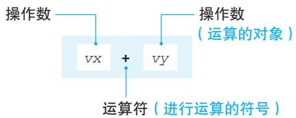
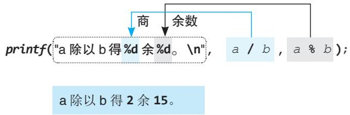
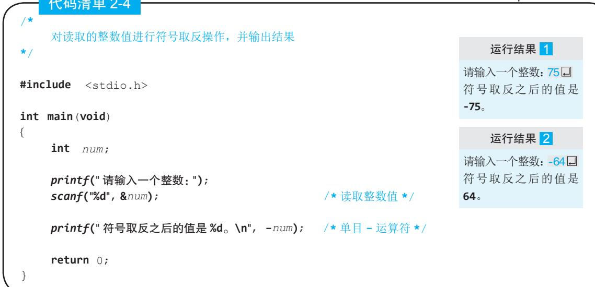
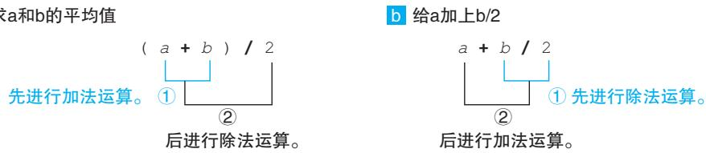
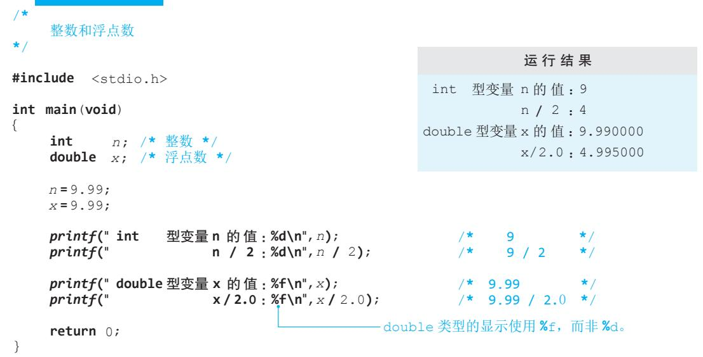
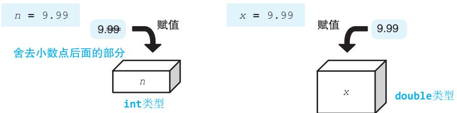
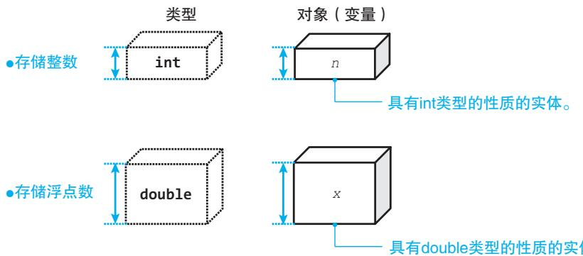
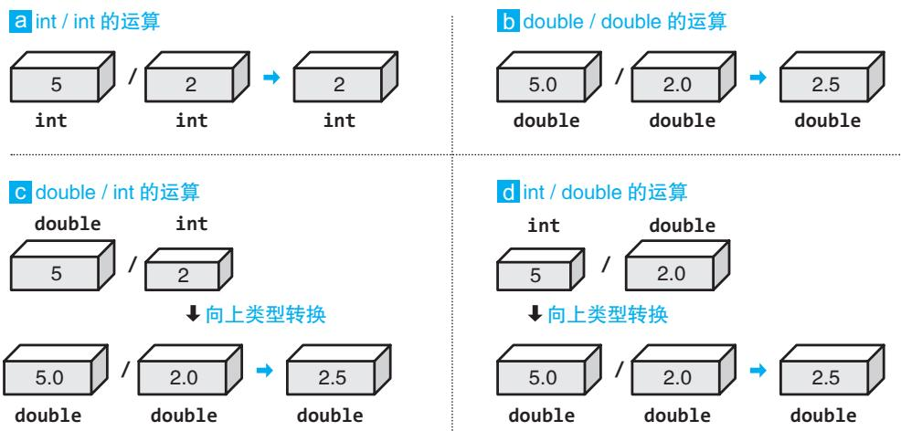
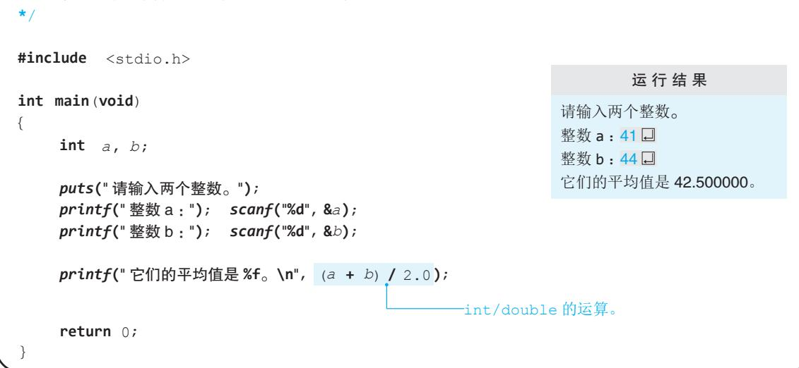

# 明解C语言 TURING图灵程序设计丛书第3版 入门篇

[日]柴田望洋/著 管杰 罗勇 杜晓静/译

# 比课本更易懂 205段代码+220幅图表

荣获日本工学教育协会著作奖双色印刷 技术书也能赏心悦目

大家好！

本书是讲解C语言基础知识的教材。为帮助大家理解，书中使用了大量的代码和图表。

请大家回忆一下学习英文时的情形。除了单词和语法之外，是不是还学习了很多在具体对话和文章中的应用示例呢？

学习编程语言时也有着类似的情况。首先，对关键字和库函数等语句和语法规则的学习至关重要。我们知道，仅仅了解单词和语法，并不能写出文章或者与人对话；同样，如果只有一些知识碎片，是不能编写程序的。

为了帮助大家学习真正的C语言程序，本书中提供了205 段完整的代码。另外，通过 220 幅图表，对语法和难懂的概念进行了详细的讲解。

示例程序较多，就相当于外语教材中表示单词和语法的用法的对话和例句较多。请大家通过这为数众多的程序和帮助加深理解的图表，开启你的C语言编程之路吧！

笔者在编写本书时使用了口语化的语言。如果读者在阅读时能感觉到像是在听笔者讲课，那笔者将倍感荣幸。

2014年7月柴田望洋

# 第章初识C语言

# 1-1 显示计算结果…

计算整数的和并显示结果  
程序和编译  
注释  
固定代码  
printf函数：格式化输出函数……  
语句  
计算并显示整数的差  
格式化字符串和转换说明  
符号的称呼  
无格式化输出  
字符串常量 10  
转义字符 10

# 1-2变量

变值和声明 初始化 ….13 声明时初始化 .14 初始化和赋值 .14

# 1-3输入和显示…… 16

通过键盘进行输入… 16\$格式化输入函数scanf…乘法运算 ….17输出函数puts· ….18总结 21

# 第∠章运算和数据类型 第2章

# 2-1运算 …24

运算符和操作数 …24  
乘除运算符和加减运算符………25  
除法运算的商和余数 ….25  
使用printf函数打印%. …26  
获取整数的最后一位数字……26  
多个转换说明 ….27  
单目运算符 …28  
赋值运算符 …….29  
表达式和赋值表达式 ….30  
表达式语句… ….30

# 2-2 数据类型 31

求平均值 . 31  
数据类型 ….32  
数据类型和对象 ….33  
整型常量和浮点型常量 ….34  
double类型的运算 ….34  
数据类型和运算 ….35  
类型转换 ….37  
转换说明 …39

# 总结 ·42

# 第3 章 分支结构程序

# 3-1 if 语句

if语句·其1. 46  
奇数的判定 47  
if语句·其2 48  
奇数・偶数的判断 ·49  
非0的判断 ·49  
if语句的结构图· 50  
相等运算符 52  
余数的判断 .53  
关系运算符 54  
嵌套的if语句· .55  
判断 57  
计算较大值 58  
计算三个数的最大值 59  
条件运算符 60  
差值计算· 61  
复合语句（程序块） 62  
逻辑运算符 65  
短路求值

# 3-2switch语句…70

switch语句和break语句 70复杂的switch语句.  
switch语句和if语句  
选择语句 74

# 总结… 75

# 第4章 程序的循环控制

# 4-1 do语句… 78

do语句 .78  
复合语句（程序块）中的声明…79  
读取一定范围内的值… … 80  
逻辑非运算符·德摩根定律……81  
德摩根定律 … 81  
求多个整数的和及平均值……82  
复合赋值运算符 …. 84  
后置递增运算符和  
后置递减运算符 85  
限定次数的循环操作 …91  
字符常量和putchar函数 ….92  
do语句和while语句· …93  
前置递增运算符和  
前置递减运算符 … 93  
do语句的显示 95  
逆向显示整数值 …96

# 4-3 for语句. .99

# 4-2 while语句 ·87

while语句 .87  
用递减运算符简化程序代码……88  
数据递增 … 90  
for语句… ….9  
使用for语句实现固定次数的  
循环… 101  
偶数的枚举 103  
约数的枚举 104  
表达式语句和空语句 104

循环语句 ….105

# 4-4多重循环 107

二重循环· 107  
用break语句强制结束循环……108  
显示图形· 109  
多重循环 111

# 4-5 程序的组成元素和格式……114

关键字 114

运算符 114   
标识符 114   
分隔符· 115   
常量和字符串常量 115   
自由的书写格式… 116   
连接相邻的字符串常量 117   
缩进… 117

总结 118

# 第 5 章 数组

# 5-1 数组 122

数组 122  
数组的声明（使用数组前的  
准备） 123  
访问数组（数组的使用方法）…123  
数组的遍历 124  
数组初始化 126  
数组的复制 127  
输入数组元素的值 129  
对数组的元素进行倒序排列…129  
使用数组进行成绩处理 131  
对象式宏 131  
数组元素的最大值和最小值…133  
赋值表达式的判断 134  
数组的元素个数 135

# 5-2 多维数组…

多维数组…

总结 142

# 6-1 什么是函数 ·146

main函数和库函数 …146  
什么是函数· …146  
函数定义 ·147  
函数调用 …148  
三个数中的最大值 151  
将函数的返回值作为参数  
传递给函数… 152  
调用其他函数· 154  
值传递 155

# 6-2 函数设计 ·158

没有返回值的函数 158  
通用性 ·159  
不含形参的函数 ·160  
函数返回值的初始化 ·161  
作用域… ·161  
文件作用域 ·162  
声明和定义 163  
函数原型声明· 163  
头文件和文件包含指令 164  
函数的通用性. ·165  
数组的传递 …166  
函数的传递和const类型的  
修饰符… .·168  
线性查找（顺序查找） ·170  
哨兵查找法 172  
多维数组的传递 175

# 6-3 作用域和存储期· .178

作用域和标识符的可见性 178  
存储期 180

# 总结… .185

# 7-1基本数据类型和数……190

算数类型和基本数据类型……190  
基数· …191  
基数转换 192

# 7-2整型和字符型… …195

整型和字符型 195  
<limits.h>头文件. ·196  
字符型 199  
位和CHAR_BIT. 200  
sizeof运算符· 200  
size_t型和typedef声明 202  
整型的灵活运用 202  
整型的內部表示 .204  
无符号整数的內部表示 .205  
有符号整数的內部表示 .207  
按位操作的逻辑运算 ·209  
位移运算符 212

# 第/ 章基本数据类型

整型常量 216  
整型常量的数据类型 ·218  
整数的显示 218  
数据溢出和异常 220

# 7-3浮点型 221

浮点型 221  
浮点型常量 .223  
<math.h>头文件 224  
循环的控制 225

# 7-4运算和运算符 …228

运算符的优先级和结合性……228  
优先级… ·228  
结合性 228  
数据类型转换 230

# 总结…… 232

# 第章动手编写各种程序吧 第8章

# 8-1 函数式宏 ·236

函数和数据类型 …236  
函数式宏· ….237  
函数和函数式宏 …238  
不带参数的函数式宏· …239  
函数式宏和逗号运算符 …240  
8-2 排序 243  
冒泡排序法 …243

# 8-3枚举类型 …246

枚举类型 ·246   
枚举常量 ·248

# 8-4 递归函数 ….251

函数和类型 251  
阶乘 252

# 8-5 输入输出和字符 ….255

getchar函数和EOF· ·255   
从输入复制到输出 256   
数字字符计数 256   
字符 258   
转义字符 ….261

# 总结 ….263

# 9-1什么是字符串…… ….66

字符串字面量 …266   
字符串字面量的长度 ·266   
字符串· ·268   
字符数组的初始化赋值 .269   
空字符串 .270   
字符串的读取… 270   
格式化显示字符串 271

# 9-2字符串数组

字符串数组. .273

# 第章字符串的基本知识

读取字符串数组中的字符串…274

# 9-3字符串处理.

字符串长度 275   
显示字符串 277   
数字字符的出现次数 ·278   
大小写字符转换 279   
字符串数组的参数传递 280

总结…… 283

# 第 10章 指针

# 10-1指针 ·286

函数的参数 ·286   
对象和地址 ·287   
取址运算符 ·288   
指针… 289   
指针运算符 ·291

# 10-2指针和函数 ·293

作为函数参数的指针 293  
计算和与差 …294  
二值互换… 296  
将两个值排序 ·297  
scanf函数和指针 ·298  
指针的类型 299  
空指针 ·300  
标量型 ·301

# 10-3 指针和数组 302

指针和数组· 302   
指针运算符和下标运算符 304   
数组和指针的不同点… ….306   
数组的传递 ….308

# 总结 311

# 第11章 第章字符串和指针

# 11-1字符串和指针… .316

用数组实现的字符串和用  
指针实现的字符串 .316用数组实现的字符串和用  
指针实现的字符串的不同点…318字符串数组… …320

# 11-2通过指针操作字符串…….323

判断字符串长度… 323   
字符串的复制 .325   
不正确的字符串复制 328   
返回指针的函数 329

# 11-3字符串处理库函数……330

strlen函数：求字符串的长度…330strcpy函数、strncpy函数：  
复制字符串 .331strcat函数、strncat函数：  
连接字符串 .332strcmp函数、strncmp函数：  
比较字符串的大小关系 ·332atoi函数、atol函数、atof函数：  
转换字符串 333

# 总结 336

# 第 12 章 结构体

12-1结构体. 340  
数据关联性 .340  
结构体 342  
结构体成员和.运算符 ·344  
成员的初始化. ….345  
结构体成员和 $_ { - > }$ 运算符 .346  
结构体和typedef. …348  
结构体和程序 ….350  
聚合类型 ….351  
返回结构体的函数 ….351  
命名空间 …353  
结构体数组 353  
派生类型 355

# 12-2作为成员的结构体 356

表示坐标的结构体 …356  
具有结构体成员的结构体……357

总结 ….361

# 第 13 章 文件处理

# 13-1 文件与流. ..364

文件与流 364  
标准流… 365  
FILE型· 365  
打开文件 365  
关闭文件 .368  
打开与关闭文件示例 .369  
文件数据汇总 . 370  
写入日期和时间 372  
获取上一次运行时的信息 376  
显示文件內容 378  
文件的复制 ·380

# 13-2文本和二进制… …382

在文本文件中保存实数 382  
文本文件和二进制文件 383  
在二进制文件中保存实数……384  
显示文件自身 .386

# 13-3 printf函数与scanf函数……389

printf函数：带格式输出……389  
scanf函数：带格式的输入……393

总结…… …397

# 附录 C语言简介

C语言的历史 …400  
K&R——C语言的圣经 400

C语言标准规范· 400

结语 .402   
参考文献 .405

# 第2章运算和数据类型

如果有人问你的身高和体重是多少，你会怎么回答呢？也许你会说，我身高175厘米，体重 60 公斤。但这些数据都是准确的吗？你的身高正好是175 厘米吗？即使用身高测量仪测出 175.3 厘米这样的数值，恐怕也是不精确的。你的实际身高可能应该是 175.2869758·厘米（而且这个数值还会随着时间不断地变化）。但是通常情况下我们说身高175 厘米，体重 60 公斤就可以了，毕竟不需要精确到那种地步。在程序的世界里也是这样，有时并没有必要表示出精确的实际数值。

本章中将会为大家介绍C 语言进行数值计算时所必备的运算和数据类型等知识。

# 2-1运算

进行加法运算的 $^ +$ 和进行乘法运算的 $^ { \star }$ 等符号，称为运算符。本节我们就来学习基本的运算符。

# 运算符和操作数

前一章我们进行了加法、减法和乘法运算，下面我们来尝试除法运算。

读取两个整数的值，然后显示出它们的和、差、积、商和余数。

程序如代码清单2-1所示。

# 代码清单2-1

chap02/list0201.c

读取两个整数的值，然后显示出它们的和、差、积、商和余数

#include <stdio.h>   
int main (void)   
{ int vx, vy; puts("请输入两个整数。")； printf("整数vx:");scanf("%d",&vx); printf("整数vy :");scanf("%d",&vy); printf("vx + vy = %d\n", vx + vy); printf("vx - vy = %d\n", vx - vy); printf("vx \* vy = %d\n", vx vy); printf("vx/vy = %d\n", VX / vy); printf("vx%%vy = %d\n", vx %vy); return 0;   
}

# 运行结果

请输入两个整数。

整数 $v x$ : 57 □ 整数 vy：21□ V $x \ + \ \ y \ y \ = \ 7 8$ $\begin{array} { r c l } { { V X } } & { { - } } & { { V Y ~ = ~ 3 6 } } \end{array}$ vx \* vy = 1197 $\begin{array} { r } { V X ~ / ~ { \cal V } Y ~ = ~ 2 } \end{array}$ Vx% vy = 15

-格式化字符串内如果连续有两个 $\%$ 符号，则只显示一

$\begin{array} { r } { \begin{array} { r c l } { \displaystyle V X } & { - } & { \displaystyle V Y , } \end{array} } \end{array}$ 只是算出从 $v x$ 中减去 vy的值，并不是真正的求差运算。也就是说，如果 vy比 vx大的话，vx-$\boldsymbol { v } _ { \mathcal { Y } }$ 的值就是负数。求差运算的程序会在第 3 章进行介绍。

像 $^ +$ 、\*这样可以进行运算的符号称为运算符（operator），作为运算对象的变量或常量称为操作数（operand）（图2-1）。

  
图2-1运算符和操作数

例如在加法运算 $\begin{array} { r l } { V X ~ + ~ } & { { } V Y } \end{array}$ 中， $^ +$ 就是运算符， $\boldsymbol { v } \boldsymbol { x }$ 和 vy就是操作数。

运算符左侧的操作数称为第一操作数或者左操作数，运算符右侧的操作数称为第二操作数或者右操作数。

C 语言中有很多运算符，7-4 节为大家提供了所有运算符的一览表。

# 乘除运算符和加減运算符

本程序中使用的五个运算符，可以大致区分为表2-1所示的乘除运算符（multiplicativeoperator）和表2-2所示的加减运算符（additive operator）。

请大家牢记这些运算符的名称。

# ■表2-1乘除运算符

<table><tr><td>双目*运算符a*b a和b的积</td><td></td><td></td></tr><tr><td>/运算符</td><td></td><td></td><td>a / b a除以 b 所得到的商（整数之间运算的时候需要舍弃小数点之后的值）</td></tr><tr><td>%运算符</td><td></td><td></td><td>a %b a除以 b所得到的余数（a和 b都必须是整数)</td></tr></table>

# ■ 表2-2加减运算符

<table><tr><td>双目 +运算符a +b a和b的和</td><td></td></tr><tr><td>双目-运算符a- b a减去b的值</td><td></td></tr></table>

$\blacktriangleright$ 乘除运算符的英文名称是 binary $^ { \star }$ operator、／ operator、%operator，加减运算符的英文名称是 binary $^ +$ operator、binary - operator。

# 除法运算的商和余数

除法运算符有两种。通过除法求商的运算符是∕。

# 商的整数部分

如上所示，除法运算只取商的整数部分，也就是说会舍弃小数点以后的部分。例如，5/3的结果是1，3/5的结果是0。

整数/整数

# 余数

“%”是求余运算符。例如，5%3 的结果是2，3%5 的结果是3。

关于这两种运算符，请参考专题 2-1。

# 使用 printf 函数输出 %

让我们来看一下程序中输出余数的地方（蓝色底纹部分）。格式化字符串中写的是 $\%$ 。这里的格式化字符串中的 $\%$ 符号具有转换说明的功能。因此，当不需要进行转换说明，而只想输出%的时候，就必须写成%%。

当使用不具有转换说明功能的 puts 函数来进行输出的时候，就不能写成 %%（这样会输出 %% 的)。

# 获取整数的最后一位数字

通过灵活地运用求余运算符，我们可以解决下面的问题。

显示读取出的整数的最后一位数字。

程序如代码清单2-2所示。

# 代码清单2-2

chap02/list0202.c

# 显示读取出的整数的最后一位数字

# 运行结果

请输入一个整数：1357最后一位是7。

#include <stdio.h>   
int main (void)   
{ int no; printf("请输入一个整数："); scanf("%d",&no); /\*读取整数的值\*/ printf("最后一位是%d。\n",no%10); return 0; no除以10所得的余数。   
}

# 运行结果2

请输入一个整数：1780最后一位是0。

# 专题 2-1除法运算的结果

进行除法运算的／运算符和 $\%$ 运算符的运算结果是依赖于编译器的。

# ■ 两个操作数都是正时

不管是哪种编译器，商和余数都是正数。举例如下。

<table><tr><td>x1y x%y</td></tr><tr><td>正÷正例x=22，y=5 4 2</td></tr></table>

2

# ■ 两个操作数中至少有一个为负时

至于∕运算符的结果是“小于代数商的最大整数”还是“大于代数商的最小整数”，要取决于编译器。举例如下。

<table><tr><td rowspan=1 colspan=1></td><td rowspan=1 colspan=1>x1 y</td><td rowspan=1 colspan=1>x%y</td><td rowspan=7 colspan=1>取决于编译器取决于编译器取决于编译器</td></tr><tr><td rowspan=2 colspan=1>负÷负 例x=-22，Y=-5</td><td rowspan=1 colspan=1>4</td><td rowspan=1 colspan=1>-2</td></tr><tr><td rowspan=1 colspan=1>5</td><td rowspan=1 colspan=1>3</td></tr><tr><td rowspan=2 colspan=1>负÷正 例x=-22，Y=5</td><td rowspan=1 colspan=1>-4</td><td rowspan=1 colspan=1>-2</td></tr><tr><td rowspan=1 colspan=1>-5</td><td rowspan=1 colspan=1>3</td></tr><tr><td rowspan=2 colspan=1>正÷负 例x=22，Y=-5</td><td rowspan=1 colspan=1>-4</td><td rowspan=1 colspan=1>2</td></tr><tr><td rowspan=1 colspan=1>-5</td><td rowspan=1 colspan=1>-3</td></tr></table>

和× $\boldsymbol { Y }$ 的符号无关（只要 $\boldsymbol { Y }$ 不是0)， $( x ~ / ~ y ) ~ \star ~ _ { Y } + \mathit { \Pi } _ { X } \% ~ _ { Y }$ 的值和 $_ { x }$ 一致。

# 多个转换说明

读取两个整数，并显示它们的商和余数。程序如代码清单2-3 所示。

# 代码清单2-3

chap02/list0203.c

读取两个整数，显示它们的商和余数 ★ #include <stdio.h> int main (void) { int a, b; puts("请输入两个整数。")； printf("整数 a:");scanf("%d", $\pmb { \mathrm { \pmb { \mathrm { \varepsilon } } } } _ { \pmb { \mathrm { \perp } } }$ ); printf("整数b :")；scanf("%d",&b); printf("a除以b得%d余%d。\n",a/b，a %b); return 0; 转换说明有两个。 }

# 运行结果

请输入两个整数。整数a：57□  
整数b：21□  
a除以b得2余15。

程序中蓝色底纹部分中包含两个转换说明%d。如图2-2 所示，这些转换说明分别对应从左边数第二个和第三个参数。

2

需要同时显示两个以上格式化数值时，可以像这样在格式化字符串中使用多个转换说明。

  
图2-2通过printf 函数显示两个格式化的值

另外，使用 scanf 函数为变量输入数值时，也可以指定两个以上的转换说明。如下所示为为int类型的变量 $a$ 和 $b$ 输入整数值。

_ scanf("%d%d", &a，&b);

/\*按顺序为a和 $b$ 输入十进制数\*/

# 练习2-1

编写一段程序，像右面那样读取两个整数，然后显示出前者是后者的百分之几。

请输入两个整数。整数x：54 □整数y：84□x的值是y的 $64 \%$ 。

# 练习2-2

编写一段程序，像右面那样读取两个整数，然后输出它们的和以及积。

请输入两个整数。  
整数a：54□  
整数b：12□  
它们的和是66，积是648。

# 单目运算符

我们来考虑一下下面这个问题。

对读取的整数值进行符号取反操作，并输出结果。

也就是说，输入75 就显示-75，输入-64 就显示64。程序如代码清单2-4所示。

# 代码清单2-4

2

到目前为止我们用到的运算符都需要两个操作数，这样的运算符称为双目运算符（binaryoperator)。在C语言中，还有只需要一个操作数的单目运算符（unary operator），以及需要三个操作数的三目运算符（ternary operator)。

在这里第一次出现的运算符就是单目运算符中的单目- 运算符（unary- operator)。可能大家都很清楚，它的功能就是对运算符进行符号取反操作。另外还有一个跟它成对的运算符单目 $^ +$ 运算符（unary $^ +$ operator)，具体请参考表2-3。

■表2-3单目 $^ +$ 运算符和单目－运算符   

<table><tr><td>单目+运算符 taa的值</td></tr><tr><td></td></tr><tr><td>单目－运算符 -a对a进行符号取反后的值</td></tr><tr><td></td></tr></table>

对 $^ +$ 和－来说，存在双目和单目两个版本。单目 $^ +$ 运算符实际上并没有进行什么运算，只是为了对应单目–运算符而准备的。

另外，单目 $^ +$ 运算符、单目-运算符、！运算符（4-1节）和 $\tilde { }$ 运算符（7-2节）这四个运算符统称为单目算术运算符（unary arithmetic operator)。

# 赋值运算符

在我们前面所列举的示例程序中，有些用到了基本赋值运算符（simple assignment operator）$=$ ，如表2-4所示。

# ■ 表 2-4基本赋值运算符

<table><tr><td>基本赋值运算符 a = b 把b的值赋给a</td></tr></table>

由于基本赋值运算符一般简称为赋值运算符，因此本书中也这么称呼。

▶ 但是，在和第 4 章中介绍的复合赋值运算符进行对比等时，为了以示区分，需要严格称为基本赋值运算符。

# 表达式和赋值表达式

表达式（expression）由变量和常量，以及连接它们的运算符组成。例如，在

$\begin{array} { r } { V X ~ + ~ 3 2 } \end{array}$ 进行加法运算的表达式

中， $V X , 3 2$ 和 $\begin{array} { r } { V X ~ + ~ 3 2 } \end{array}$ 都是表达式。

$V C ~ = ~ \mathrm { { \small ~ V X ~ + ~ } } ~ 3 2$ 赋值表达式

中，vC、vx、32、 $\begin{array} { r l } { V X } & { { } + \quad 3 2 } \end{array}$ 和 $V C ~ = ~ \mathrm { { \small ~ { ~ v ~ x ~ } ~ } } + ~ 3 2$ 都可以看作表达式。当然，vc是赋值运算符 $=$ 的第一操作数， $\begin{array} { r } { V X ~ + ~ 3 2 } \end{array}$ 是第二操作数。

一般情况下，使用〇运算符的表达式，称为〇〇表达式。因此，使用赋值运算符的表达式，就称为赋值表达式（assignment expression)。

# 表达式语句

我们在1-1节中介绍过，C语言规定语句必须要以分号结尾，因此前面提到的赋值表达式写成如下形式，才能成为正确的语句。

$V C ~ = ~ \bar { V } X ~ + ~ 3 2 ~ i$ /\*表达式语句\*/

这种由表达式和分号组成的语句称为表达式语句（expression statement)）。

第 6 章中会对表达式语句进行详细介绍，从下一章开始，将带领大家学习 if 语句和 while 语句等表达式语句之外的语句形式。

# 2-2 数据类型

到目前为止，我们所使用的 int 类型是仅处理整数的数据类型。而除了int 类型之外，还有很多种数据类型。本节我们就来学习处理实数的double类型等。

# 求平均值

让我们来考虑一下这个问题：

读取两个整数，求出它们的平均值。

程序如代码清单2-5所示。

# 代码清单2-5

读取两个整数，显示出它们的平均值

chap02/list0205.c

# 运行结果

#include <stdio.h>  
int main (void)  
{int a, b;puts("请输入两个整数。")；printf("整数a:");scanf("%d",&a);printf("整数b:")；scanf("%d"，&b);printf("它们的平均值是%d。\n"，(a +b)/2);return 0;  
}请输入两个整数。整数a：41□  
整数b：44 □  
它们的平均值是42。

将表达式 $a + b$ 括起来的（），是优先运算的标记。如果该表达式是

a+ b/ 2

就变成了求 $a$ 和 $b / 2$ 的和（图2-3）。这实际上与我们平时所做的数学计算相同，即要遵循先乘除后加减的顺序。

关于所有运算符的优先级，我们将在表 7-11 中加以总结。

#

  
图2-3()造成的运算顺序的变化

# 数据类型

通过运行实例我们可以发现输出的平均值并不是 42.5 而是 42，也就是说，小数点以后的部分被舍弃了。只处理数值的整数部分—这就是int 类型（type）的特征。

C语言中以浮点数（floating-point number）的形式来表示实数，浮点数有几种不同的类型，这里我们来学习一下double（双精度浮点数）类型。让我们通过代码清单2-6 来看看int 型整数和 double型浮点数之间的区别。

# 代码清单2-6

chap02/list0206.c

我们声明一个int型变量 $n$ 和一个double型变量 $_ { x }$ ，并把9.99作为值赋给它们。如图2-4所示，把实数值赋给int 型变量时，小数点以后的部分会被舍弃，因此存储在 $n$ 中的值就变成了9。

当然，对于 $n / 2$ ，也就是9/2来说，由于是整数∕整数运算，所以结果的小数点后的部分也被舍弃了。

另外需要注意的是，在使用 printf 函数输出 double 型值的时候，转换说明不能使用 $\% 0$ ,

而要使用%f。

转换说明 %f 中的f 就是浮点数 floating-point 的首字母。%f 默认显示小数点后 6 位数字，变更显示位数的方法将会在后面介绍。

  
图2-4整数和浮点数

# 数据类型和对象

接下来我们进一步学习数据类型和变量。

在图2-5中，数据类型int和double放在虚线框中，它们对应的变量 $n$ 和变量 $_ { x }$ 放在实线框中。代表数据类型的虚线框和代表它们对应变量的实线框的大小是一样的。

  
图2-5数据类型和对象

从前面的程序可以看出，int 类型只能用来存储整数，即使把实数值赋给它，也只能保留整数部分。与之相对，浮点数中的 double类型可以用来存储包含小数的实数值。

C语言中有很多种数据类型，在第7章将会进行详细介绍。

不过，每种类型可存储的值都是有范围的。例如，int 类型的取值范围是-32767 到32767。

$\blacktriangleright$ 编译器不同，取值范围也可能更大。具体请参考7-2 节。

这些数据类型都有一些固有的属性，继承了这些属性而创建出来的实体变量称为对象

(object)。换句话说，我们还可以像下面这样理解。

# 注意

数据类型实际上相当于隐藏着各种属性的一个设计蓝图（可以想象成做章鱼小丸子用的模具），包含某个类型的对象（变量），就是根据这个设计蓝图创建出的实体（相当于用模具做出来的真正的章鱼小丸子)。

另外，“变量”这个词应用广泛，听起来比“对象”更习惯一些，加之本书对专业术语不想太过拘泥，所以本书中统一使用“变量”这个称呼。

# 整型常量和浮点型常量

直接在程序中指定数值的常量也有类型的区别。像5 和37 这样的常量，它们都是整数类型的，所以称为整型常量（integer constant)。像3.14这样包含小数的常量，称为浮点型常量(floating constant)。

通常整型常量都是 int 类型，而浮点型常量都是 double 类型。

当数值过大，或者有特殊需求的时候，也可以使用其他类型。请参考第 7章。

# double 类型的运算

编写一段程序，读取两个实数值，显示出它们的和、差、积、商。具体如代码清单2-7 所示。

# 代码清单2-7

chap02/list0207.c

读取两个实数值，用实数显示出它们的和、差、积、商

运行结果

#include <stdio.h>   
int main (void)   
{ double vx, vy; /\*浮点数\*/ puts("请输入两个数。")； printf("实数vx:");scanf("%lf",&vx); printf("实数vy :");scanf("%1f",&vy); 小写英文字母 1。 printf("vx + vy = %f\n", vx + vy); printf("vx - vy = %f\n", vx - vy); printf("vx \* vy = %f\n", vx \* vy); printf("vx / vy = %f\n", $v x / \ v y )$ ; return 0; 请输入两个数。   
实数 $v x$ ：45.77□   
实数 vy：35.3 □   
$\mathit { V X } \ + \ \mathit { V Y } \ = \ 8 1 . 0 7 0 0 0 0$ $\begin{array} { l l l } { { V X } } & { { - } } & { { V Y = 1 0 . 4 7 0 0 0 0 } } \end{array}$ $\mathit { v x } \texttt { * } _ { V Y } = \texttt { 1 6 1 5 . 6 8 1 0 0 0 }$ $\mathrm { \Delta } \nabla X \ / \ \mathrm { \Delta } \ V Y = \ 1 . 2 9 6 6 0 1$

double类型不能使用求余数的运算符%。

如表2-5 所示，double 类型的变量通过scanf 函数赋值的时候需要使用格式字符串%lf，请注意这一点。

■表2-5转换说明  

<table><tr><td>int 类型</td><td>double 类型</td><td></td></tr><tr><td>使用printf函数显示</td><td>printf(&quot;%d&quot;,no)</td><td>printf(&quot;%f&quot;, no)</td></tr><tr><td>使用scanf函数读取</td><td>scanf(&quot;%d&quot;,&amp;no)</td><td>scanf(&quot;%lf&quot;,&amp;no)</td></tr></table>

# 练习2-3

编写一段程序，像右面那样显示出读取的实数的值。

请输入一个实数：57.3 □你输入的是57.300000。

# 数据类型和运算

进行整数∕整数运算的时候，商的小数部分会被舍弃，但是浮点数之间的运算，就不会进行舍弃处理。

运算符₆ 本身的特性决定了它只能用于整数之间的运算，而不能用于浮点数之间的运算。

如图2-6所示，像a“int/int”和D“double/double”这样两个类型相同的操作数之间的运算，所得结果的数据类型和运算对象的数据类型是一致的。

另外，像C“double/int”和d“int/double”这样一个操作数是int类型，另一个操作数是 double 类型的情况，int 类型的操作数会进行隐式类型转换，自动向上转型为 double 类型，运算演变为double 类型之间的运算。因此，运算的结果也就变成了double 类型。

当然，这样的规则对于 $^ +$ 或者 $^ { \star }$ 等其他运算也适用。

  
图2-6操作数的类型和运算结果的类型

由于C语言包含了很多种数据类型，详细的规则非常复杂，因此我们可以大致理解如下（详细的规则会在7-4节进行介绍)。

# 注意

运算对象，即操作数的类型不同时，较小的数据类型的操作数会转换为较大的数据类型（范围更大），然后再进行运算。

$\blacktriangleright$ 所谓的“较大的数据类型”，并不是说 double 类型实际上比 int 类型更大，而是说它还可以保存小数点之后的部分。

让我们通过代码清单2-8所示的程序来验证一下这一规则。

# 代码清单2-8

chap02/list0208.c

#

应Ⅲ双泊天生阳烂开\*|#include <stdio.h>int main (void){int n1, n2, n3, n4; /\*整数\*/double d1, d2, d3, d4; /\*浮点数\*/$\begin{array} { l } { { n \bar { \lambda } ~ = ~ 5 ~ ~ , ~ / ~ 2 ; } } \\ { { n \bar { \lambda } ~ = ~ 5 . ~ 0 ~ / ~ 2 . ~ 0 ; } } \\ { { n \bar { \lambda } ~ = ~ 5 . ~ 0 ~ / ~ 2 ; } } \\ { { n \bar { \lambda } ~ = ~ 5 ~ / ~ 2 . ~ 0 ; } } \\ { { \nonumber } } \\ { { \bar { d } \bar { \lambda } ~ = ~ 5 ~ / ~ 2 ; } } \\ { { \bar { d } \bar { \lambda } ~ = ~ 5 . ~ 0 ~ / ~ 2 . ~ 0 ; } } \\ { { \bar { d } \bar { \lambda } ~ = ~ 5 . ~ 0 ~ / ~ 2 ; } } \\ { { \bar { d } \bar { \lambda } ~ = ~ 5 . ~ 0 ~ / ~ 2 ; } } \\ { { \bar { d } \bar { \lambda } ~ = ~ 5 ~ / ~ 2 ~ . ~ 0 ; } } \end{array}$ /\*n1←2 \*/[] /\*n2←2.5（赋值时舍弃小数点以后的部分）\*//\*n3←2.5（赋值时舍弃小数点以后的部分） $^ { \star }$ //\*n4←2.5（赋值时舍弃小数点以后的部分） $^ { \star }$ //\* d1 ← 2 \*/[] /\* d2 ← 2.5 \*//\*d3←2.5 \*/ 运行结果[ /\* d4← 2.5\*/printf("n1 = %d\n", n1); $\begin{array} { r } { \begin{array} { r c l } { n \mathcal { 1 } } & { = } & { 2 } \\ { n \mathcal { 2 } } & { = } & { 2 } \\ { n \mathcal { 3 } } & { = } & { 2 } \\ { n \mathcal { 4 } } & { = } & { 2 } \end{array} } \end{array}$ printf("n2 = %d\n", n2);printf("n3 = %d\n",n3);printf("n4 = %d\n\n", n4);输出空行。 d1 = 2.000000printf("d1 = %f\n", d1);printf("d2 $=$ %f\n",d2); d2 = 2.500000printf("d3 $=$ %f\n",d3); d3 = 2.500000printf("d4 $=$ %f\n", $d 4 ^ { \cdot }$ ); d4 = 2.500000return 0;}

本程序中所进行的赋值操作如下所示。

# $\bullet$ int 型变量的赋值

把2赋给int型变量n1，把2.5分别赋给 $n 2$ 、n3和n4。由于在赋值的时候会舍弃掉小数点之后的部分，因此最后这四个变量的值都是2。

# ● double 型变量的赋值

把2 赋值给 double型变量d1（但是因为d1 是 double 型，所以2会被解释为2.0)。把2.5分别赋给d2、d3和d4的时候，它们都能把这些值完整地保存起来。

# 练习2-4

编写程序对整型常量、浮点型常量、int 型变量和 double 型变量进行乘除等各种运算，从而验证本节介绍的规则。

# 类型转换

代码清单2-5 是计算两个整数的平均值的程序，只是输出了平均值的整数部分。这次我们尝试将小数部分也一起输出。程序如代码清单2-9所示。

# 代码清单2-9

chap02/list0209.c

读取两个整数并用浮点数显示出它们平均值

让我们来看一下求平均值的表达式（蓝色底纹部分）。

首先计算的是括号内的a $^ +$ b部分。由于该运算是“int $^ +$ int”的运算，所以结果也是int型整数。因此，蓝色底纹部分整体的运算如下所示。

# int/double

整数除以实数

运算结果是double 型。程序执行后将求出41和44的平均值42.5。

# \*

但是，日常生活中计算平均值的时候，我们都会说“除以 $2 ^ { \dprime }$ ，而不会说“除以 $2 . 0 ^ { \dprime \dprime }$ o将两个整数的和转换为实数，然后再除以2 计算平均值的程序如代码清单2-10 所示。/运算符左边的操作数——表达式(double） $\exists + \mathrm { b }$ ）的形式如下。

（数据类型）表达式 类型转换表达式

通常这种形式的表达式会把表达式的值转换为该数据类型对应的值。

例如，(int)5.7 会把浮点数 5.7 的小数部分舍去，从而转换为 int 类型的5；(double)5会将整数5 转换为 double 类型的5.0。

将这些转换用图来表示，就是图3-7。

# 代码清单2-10

chap02/list0210.c

读取两个整数并用实数显示出它们的平均值（类型转换）

\*运行结果  
#include <stdio.h> 请输入两个整数。  
int main (oid) 整数b：41回int a, b; 它们的平均值是 42.500000。puts("请输入两个整数。")；printf("整数 a:"); scanf("%d", $\& a$ );printf("整数 b:")； scanf("%d", &b);printf("它们的平均值是%f。\n",(double)(a + b)/ 2); /\*类型转换\*/return 0; double/int 的运算。  
}

这样的显式转换就称为类型转换（cast），（）称为类型转换运算符（cast operator），如表2-6所示。

$\blacktriangleright$ 英语的cast 有很多种意思。比如，作为动词来说，有“扮演某角色”“投掷”“使转向”“计算”“使弯曲”等意思。
