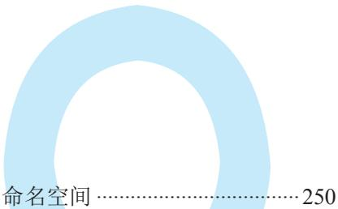

# 明解C语言 TURING图灵程序设计丛书第3版 入门篇

[日]柴田望洋/著 管杰 罗勇 杜晓静/译

# 比课本更易懂 205段代码+220幅图表

荣获日本工学教育协会著作奖双色印刷 技术书也能赏心悦目

大家好！

本书是讲解C语言基础知识的教材。为帮助大家理解，书中使用了大量的代码和图表。

请大家回忆一下学习英文时的情形。除了单词和语法之外，是不是还学习了很多在具体对话和文章中的应用示例呢？

学习编程语言时也有着类似的情况。首先，对关键字和库函数等语句和语法规则的学习至关重要。我们知道，仅仅了解单词和语法，并不能写出文章或者与人对话；同样，如果只有一些知识碎片，是不能编写程序的。

为了帮助大家学习真正的C语言程序，本书中提供了205 段完整的代码。另外，通过 220 幅图表，对语法和难懂的概念进行了详细的讲解。

示例程序较多，就相当于外语教材中表示单词和语法的用法的对话和例句较多。请大家通过这为数众多的程序和帮助加深理解的图表，开启你的C语言编程之路吧！

笔者在编写本书时使用了口语化的语言。如果读者在阅读时能感觉到像是在听笔者讲课，那笔者将倍感荣幸。

2014年7月柴田望洋

# 第1章初识C语言

# 1-1 显示计算结果…

计算整数的和并显示结果  
程序和编译  
注释  
固定代码  
printf函数：格式化输出函数……  
语句  
计算并显示整数的差  
格式化字符串和转换说明  
符号的称呼  
无格式化输出  
字符串常量 10  
转义字符 10

# 1-2变量

变值和声明 初始化 ….13

声明时初始化 .14 

初始化和赋值 .14

# 1-3输入和显示…… 16

通过键盘进行输入… 16
\$格式化输入函数scanf…乘法运算 ….17
输出函数puts· ….18
总结 21

# 第2章运算和数据类型

# 2-1运算 …24

运算符和操作数 …24  
乘除运算符和加减运算符………25  
除法运算的商和余数 ….25  
使用printf函数打印%. …26  
获取整数的最后一位数字……26  
多个转换说明 ….27  
单目运算符 …28  
赋值运算符 …….29  
表达式和赋值表达式 ….30  
表达式语句… ….30

# 2-2 数据类型 31

求平均值 . 31  
数据类型 ….32  
数据类型和对象 ….33  
整型常量和浮点型常量 ….34  
double类型的运算 ….34  
数据类型和运算 ….35  
类型转换 ….37  
转换说明 …39

# 总结 ·42

# 第3章 分支结构程序

# 3-1 if 语句

if语句·其1. 46  
奇数的判定 47  
if语句·其2 48  
奇数・偶数的判断 ·49  
非0的判断 ·49  
if语句的结构图· 50  
相等运算符 52  
余数的判断 .53  
关系运算符 54  
嵌套的if语句· .55  
判断 57  
计算较大值 58  
计算三个数的最大值 59  
条件运算符 60  
差值计算· 61  
复合语句（程序块） 62  
逻辑运算符 65  
短路求值

# 3-2switch语句…70

switch语句和break语句 70复杂的switch语句.  
switch语句和if语句  
选择语句 74

# 总结… 75

# 第4章 程序的循环控制

# 4-1 do语句… 78

do语句 .78  
复合语句（程序块）中的声明…79  
读取一定范围内的值… … 80  
逻辑非运算符·德摩根定律……81  
德摩根定律 … 81  
求多个整数的和及平均值……82  
复合赋值运算符 …. 84  
后置递增运算符和  
后置递减运算符 85  
限定次数的循环操作 …91  
字符常量和putchar函数 ….92  
do语句和while语句· …93  
前置递增运算符和  
前置递减运算符 … 93  
do语句的显示 95  
逆向显示整数值 …96

# 4-3 for语句. .99

# 4-2 while语句 ·87

while语句 .87  
用递减运算符简化程序代码……88  
数据递增 … 90  
for语句… ….9  
使用for语句实现固定次数的  
循环… 101  
偶数的枚举 103  
约数的枚举 104  
表达式语句和空语句 104

循环语句 ….105

# 4-4多重循环 107

二重循环· 107  
用break语句强制结束循环……108  
显示图形· 109  
多重循环 111

# 4-5 程序的组成元素和格式……114

关键字 114

运算符 114   
标识符 114   
分隔符· 115   
常量和字符串常量 115   
自由的书写格式… 116   
连接相邻的字符串常量 117   
缩进… 117

总结 118

# 第 5 章 数组

# 5-1 数组 122

数组 122  
数组的声明（使用数组前的  
准备） 123  
访问数组（数组的使用方法）…123  
数组的遍历 124  
数组初始化 126  
数组的复制 127  
输入数组元素的值 129  
对数组的元素进行倒序排列…129  
使用数组进行成绩处理 131  
对象式宏 131  
数组元素的最大值和最小值…133  
赋值表达式的判断 134  
数组的元素个数 135

# 5-2 多维数组…

多维数组…

总结 142

# 6-1 什么是函数 ·146

main函数和库函数 …146  
什么是函数· …146  
函数定义 ·147  
函数调用 …148  
三个数中的最大值 151  
将函数的返回值作为参数  
传递给函数… 152  
调用其他函数· 154  
值传递 155

# 6-2 函数设计 ·158

没有返回值的函数 158  
通用性 ·159  
不含形参的函数 ·160  
函数返回值的初始化 ·161  
作用域… ·161  
文件作用域 ·162  
声明和定义 163  
函数原型声明· 163  
头文件和文件包含指令 164  
函数的通用性. ·165  
数组的传递 …166  
函数的传递和const类型的  
修饰符… .·168  
线性查找（顺序查找） ·170  
哨兵查找法 172  
多维数组的传递 175

# 6-3 作用域和存储期· .178

作用域和标识符的可见性 178  
存储期 180

# 总结… .185

# 7-1基本数据类型和数……190

算数类型和基本数据类型……190  
基数· …191  
基数转换 192

# 7-2整型和字符型… …195

整型和字符型 195  
<limits.h>头文件. ·196  
字符型 199  
位和CHAR_BIT. 200  
sizeof运算符· 200  
size_t型和typedef声明 202  
整型的灵活运用 202  
整型的內部表示 .204  
无符号整数的內部表示 .205  
有符号整数的內部表示 .207  
按位操作的逻辑运算 ·209  
位移运算符 212

# 第7章基本数据类型

整型常量 216  
整型常量的数据类型 ·218  
整数的显示 218  
数据溢出和异常 220

# 7-3浮点型 221

浮点型 221  
浮点型常量 .223  
<math.h>头文件 224  
循环的控制 225

# 7-4运算和运算符 …228

运算符的优先级和结合性……228  
优先级… ·228  
结合性 228  
数据类型转换 230

# 总结…… 232

# 第8章动手编写各种程序吧 第8章

# 8-1 函数式宏 ·236

函数和数据类型 …236  
函数式宏· ….237  
函数和函数式宏 …238  
不带参数的函数式宏· …239  
函数式宏和逗号运算符 …240  
8-2 排序 243  
冒泡排序法 …243

# 8-3枚举类型 …246

枚举类型 ·246   
枚举常量 ·248

# 8-4 递归函数 ….251

函数和类型 251  
阶乘 252

# 8-5 输入输出和字符 ….255

getchar函数和EOF· ·255   
从输入复制到输出 256   
数字字符计数 256   
字符 258   
转义字符 ….261

# 总结 ….263

# 第9章字符串的基本知识

# 9-1什么是字符串…… ….66

字符串字面量 …266   
字符串字面量的长度 ·266   
字符串· ·268   
字符数组的初始化赋值 .269   
空字符串 .270   
字符串的读取… 270   
格式化显示字符串 271

# 9-2字符串数组

字符串数组. .273
读取字符串数组中的字符串…274

# 9-3字符串处理.

字符串长度 275   
显示字符串 277   
数字字符的出现次数 ·278   
大小写字符转换 279   
字符串数组的参数传递 280
总结…… 283

# 第 10章 指针

# 10-1指针 ·286

函数的参数 ·286   
对象和地址 ·287   
取址运算符 ·288   
指针… 289   
指针运算符 ·291

# 10-2指针和函数 ·293

作为函数参数的指针 293  
计算和与差 …294  
二值互换… 296  
将两个值排序 ·297  
scanf函数和指针 ·298  
指针的类型 299  
空指针 ·300  
标量型 ·301

# 10-3 指针和数组 302

指针和数组· 302   
指针运算符和下标运算符 304   
数组和指针的不同点… ….306   
数组的传递 ….308

# 总结 311

# 第11章 第章字符串和指针

# 11-1字符串和指针… .316

用数组实现的字符串和用  
指针实现的字符串 .316用数组实现的字符串和用  
指针实现的字符串的不同点…318字符串数组… …320

# 11-2通过指针操作字符串…….323

判断字符串长度… 323   
字符串的复制 .325   
不正确的字符串复制 328   
返回指针的函数 329

# 11-3字符串处理库函数……330

strlen函数：求字符串的长度…330strcpy函数、strncpy函数：  
复制字符串 .331strcat函数、strncat函数：  
连接字符串 .332strcmp函数、strncmp函数：  
比较字符串的大小关系 ·332atoi函数、atol函数、atof函数：  
转换字符串 333

# 总结 336

# 第 12 章 结构体

12-1结构体. 340  
数据关联性 .340  
结构体 342  
结构体成员和.运算符 ·344  
成员的初始化. ….345  
结构体成员和 $_ { - > }$ 运算符 .346  
结构体和typedef. …348  
结构体和程序 ….350  
聚合类型 ….351  
返回结构体的函数 ….351  
命名空间 …353  
结构体数组 353  
派生类型 355

# 12-2作为成员的结构体 356

表示坐标的结构体 …356  
具有结构体成员的结构体……357

总结 ….361

# 第 13 章 文件处理

# 13-1 文件与流. ..364

文件与流 364  
标准流… 365  
FILE型· 365  
打开文件 365  
关闭文件 .368  
打开与关闭文件示例 .369  
文件数据汇总 . 370  
写入日期和时间 372  
获取上一次运行时的信息 376  
显示文件內容 378  
文件的复制 ·380

# 13-2文本和二进制… …382

在文本文件中保存实数 382  
文本文件和二进制文件 383  
在二进制文件中保存实数……384  
显示文件自身 .386

# 13-3 printf函数与scanf函数……389

printf函数：带格式输出……389  
scanf函数：带格式的输入……393
总结…… …397

# 附录 C语言简介

C语言的历史 …400  
K&R——C语言的圣经 400
C语言标准规范· 400
结语 .402   
参考文献 .405
